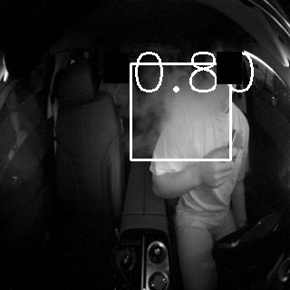
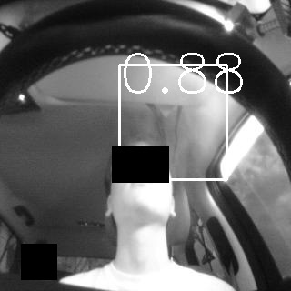
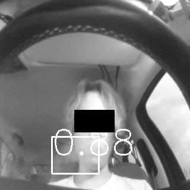

# SmokeDetection - Performance
### - Dataset
#### &ensp; train / valid / test (images) & annotations (json labels) : smoke detection 데이터 
#### &ensp; smoke_test_data_classification: classification 성능 계산용 데이터
##### &ensp;&ensp; - genuine : 담배 피는 데이터 (image)
##### &ensp;&ensp; - imposter : 담배 피지 않는 데이터 (image)
---
### - Classification

smoke detect 유무로 판단
```
  # Room mirror (fov 170) - confidence 0.61 / nms threshold 0.3
  Precision: 90.91%
  Recall: 90.91%

  # Steering Wheel (fov 90)
  Precision: 88.406%
  Recall: 87.143%
``` 

---
### - Detection (confidence 0.1 & nms threshold 0.3) 
### Room mirror (fov 170) 
#### Average Precision:
| class   | AP@0.5:0.95     | AP @0.5 |
|:--------|:-------|:-------|
| smoke    | 27.579 | 66.5 |

#### Average Recall:
| class   | AR @0.5:0.95    | AR @0.5 |
|:--------|:-------|:-------|
| smoke    | 33.832 | 71.0


### Steering Wheel (fov 90)
#### Average Precision:
| class   | AP@0.5:0.95     |
|:--------|:-------|
| smoke    | 38.968 |

#### Average Recall:
| class   | AR @0.5:0.95    |
|:--------|:-------|
| smoke    | 45.359 |

---
### Demo
### Room mirror (fov 170)
<figure class="thrid">  
  </a> 
</figure>


### Steering Wheel (fov 90)
<figure class="thrid">  
  </a>  
    </a> 
</figure>
